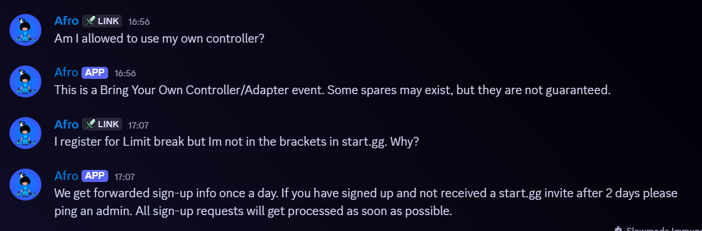

# Limit Break FAQ Bot
Have built this discord bot in order to answer frequently asked questions
around a Super Smash Bros. Ultimate tournament I help organise/run every year at Cyprus Comic Con,
called Limit Break.

## Flow:
```
Discord Message
      ↓
Channel Filter (#limit-break-questions only)
      ↓
Normalization (clean text)
      ↓
Synonym Mapping
      ↓
Intent Matching (patterns)
      ↓
Fuzzy Scoring (RapidFuzz)
      ↓
Confidence Check
      ↓
Response OR Fallback
```

## Example:
